# NTHU Nachos
Assignments for NTHU Prof. Jerry Chou's 2023 Operating System Course (MP1-MP3).

Other assignments of this course please see [Nachos MP4](https://github.com/yhkuo41/NTHU_Nachos_MP4) and [Pthread](https://github.com/yhkuo41/NTHU_OS_Pthread).
## Reports
[MP1 System Call](./MP1_report_41.pdf) & [Spec](./2023_MP1_Spec_v1.pdf)

[MP2 Multi-Programming](./MP2_report_41.pdf) & [Spec](./2023_MP2_spec_v2.pdf)

[MP3 CPU Scheduling](./MP3_report_73.pdf) & [Spec](./2023_MP3_spec_v2.pdf)

 
